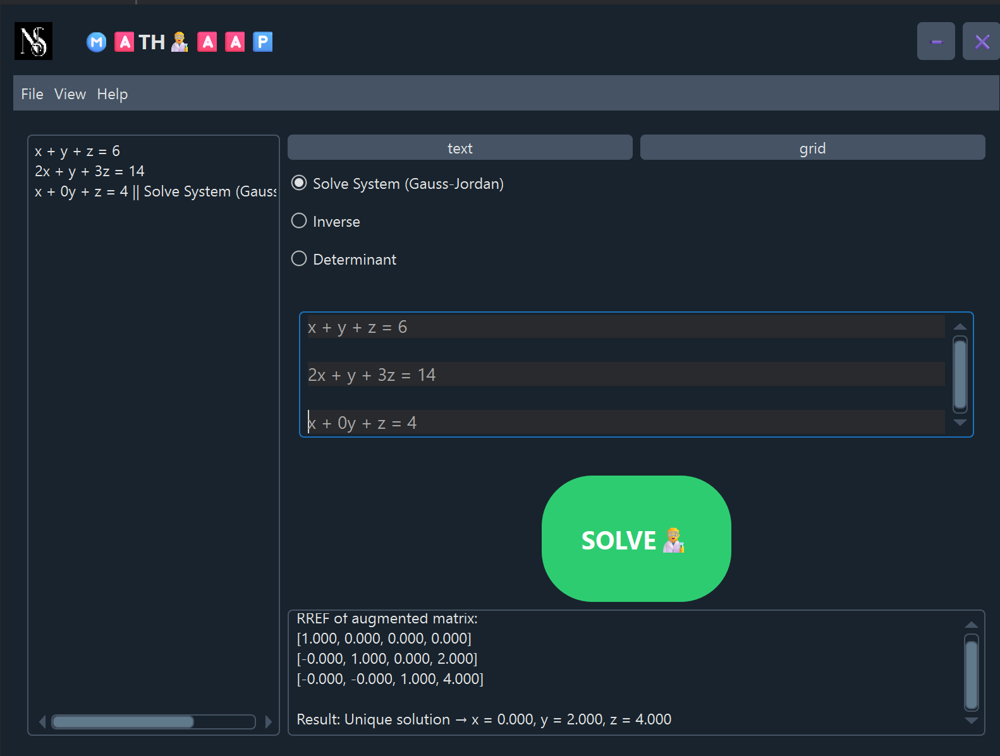

# **Linear Algebra Solver**  
  


<table align="center">
  <tr>
    <td align="center">
      <br>
      <sub>⏺️ text mode</sub>
    </td>
    <td align="center">
      <br>
      <sub>⏺️ grid mode</sub>
    </td>
  </tr>
</table>


A **PySide6-based GUI application** for solving **multivariable linear equations** (using **Gauss-Jordan elimination**), calculating **matrix determinants**, and computing **matrix inverses**.  

---


## 🔽 Download

➡️ [Go to Release Page](https://github.com/nima-salamat/LinearAlgebra/releases)  
⬇️ [Download MathApp.exe](https://github.com/nima-salamat/LinearAlgebra/releases/download/v1.0.0/MathApp.exe)


## **Features**  
✔ **Linear Equation Solver** – Solves systems of linear equations using **Gauss-Jordan elimination**.  
✔ **Determinant Calculator** – Computes the determinant of any square matrix.  
✔ **Matrix Inversion** – Finds the inverse of invertible matrices.  
✔ **User-Friendly GUI** – Built with **PySide6** for a smooth interactive experience.  
✔ **Input Validation** – Ensures correct matrix dimensions and prevents invalid operations.  

---

## **Installation**  
1. **Clone the repository:**  
   ```bash
   git clone https://github.com/nima-salamat/LinearAlgebra.git
   cd LinearAlgebra
   cd src
   ```

2. **Install dependencies (Python 3.8+ required):**  
   ```bash
   pip install PySide6 qdarkstyle
   ```

3. **Run the application:**  
   ```bash
   python manager.py
   ```

---

## **Usage**  
1. **Enter your matrix** in the input fields.  
2. **Select an operation**:  
   - Solve linear equations (Ax = b).  
   - Calculate determinant.  
   - Find matrix inverse.  
3. **View results** in the output section.  

---

## **Code Structure**  
```
/LinearAlgebra
|__ /src
    │── manager.py                # Main application (PySide6 GUI)  
    │── /ui
        |__ __init__.py
        |__ ui.py
        |__ favicon.ico     
    │── /matrix    
        |__  __init__.py 
        |__  test.py
        |__  MatrixOperations.py                        
└── README.md  
```

---

## **Dependencies**  
- **PySide6** – For the GUI.  
- **qdarkstyle** – For the dark and light mode style.  


